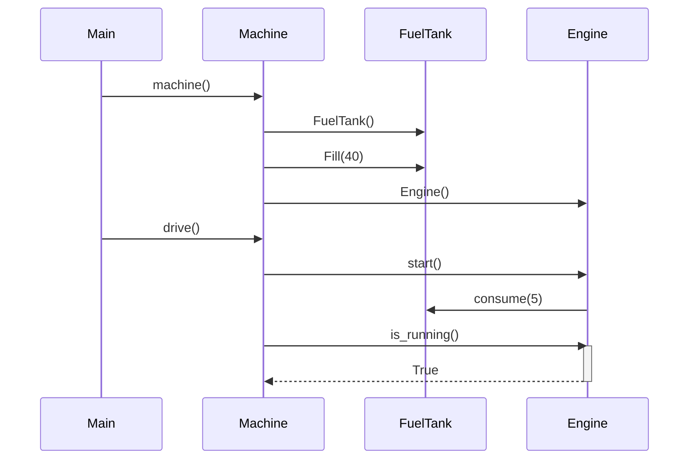

```mermaid
sequenceDiagram
    Main->>Machine: machine()
    Machine->>FuelTank: FuelTank()
    Machine->>FuelTank: Fill(40)
    Machine->>Engine: Engine()
 
    
    Main->>Machine: drive()
    Machine->>Engine: start()
    Engine->>FuelTank: consume(5)
    Machine->>Engine: is_running()
    activate Engine
    Engine-->>Machine: True
    deactivate Engine
```
