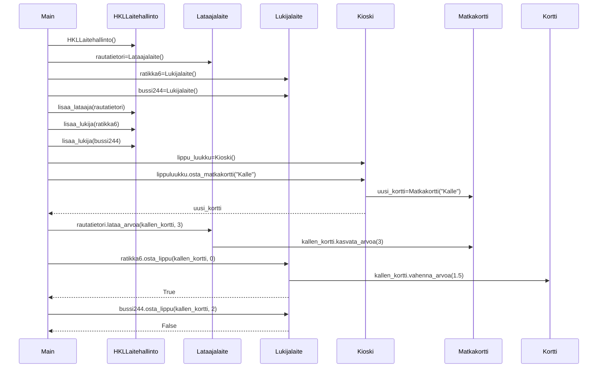

```mermaid
sequenceDiagram
    Main->>HKLLaitehallinto: HKLLaitehallinto()
    Main->>Lataajalaite: rautatietori=Lataajalaite()
    Main->>Lukijalaite: ratikka6=Lukijalaite()
    Main->>Lukijalaite: bussi244=Lukijalaite()
    
    Main->>HKLLaitehallinto: lisaa_lataaja(rautatietori)
    Main->>HKLLaitehallinto: lisaa_lukija(ratikka6)
    Main->>HKLLaitehallinto: lisaa_lukija(bussi244)
    
    Main->>Kioski: lippu_luukku=Kioski()
    Main->>Kioski: lippuluukku.osta_matkakortti("Kalle")
    Kioski->>Matkakortti: uusi_kortti=Matkakortti("Kalle")
    Kioski-->>Main: uusi_kortti
    
    Main->>Lataajalaite: rautatietori.lataa_arvoa(kallen_kortti, 3)
    Lataajalaite->>Matkakortti: kallen_kortti.kasvata_arvoa(3)
    Main->>Lukijalaite: ratikka6.osta_lippu(kallen_kortti, 0)
    Lukijalaite->>Kortti: kallen_kortti.vahenna_arvoa(1.5)
    Lukijalaite-->>Main: True
    Main->>Lukijalaite: bussi244.osta_lippu(kallen_kortti, 2)
    Lukijalaite-->>Main: False    
    
    

```

