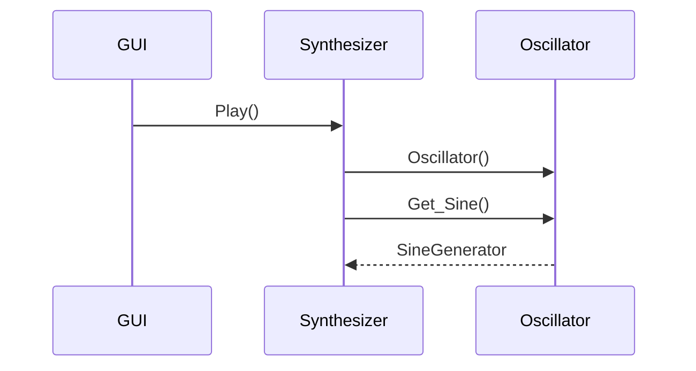

# Arkkitehtuurikuvaus

## Rakenne ja sovelluslogiikka

Ohjelman päätoiminnallisuus on sijoitettu kahteen hakemistoon: synthesizer ja gui. Synthesizer sisältää äänen tuottamisesta ja kontrolloinnista vastaavat luokat. Gui sisältää ohjelman käyttöliittymän. 

Ohjelman toimminnallisuudesta vastaan seuraavat luokat:

Main luokka käynnistää sovelluksen ja kutsuu gui luokkaa. Gui luokka käsittelee käyttäjän antaman inputin. Synthesizer luokka vastaa ohjelman päätoiminnallisuudesta ja kutsuu tarvittaessa Oscillator ja wavetofile luokkia.

## Päätoiminnallisuus

Äänentuotannon toiminnallisuutta siniaaltoa muodostaessa kuvaa seuraava sekvenssikaavio:

